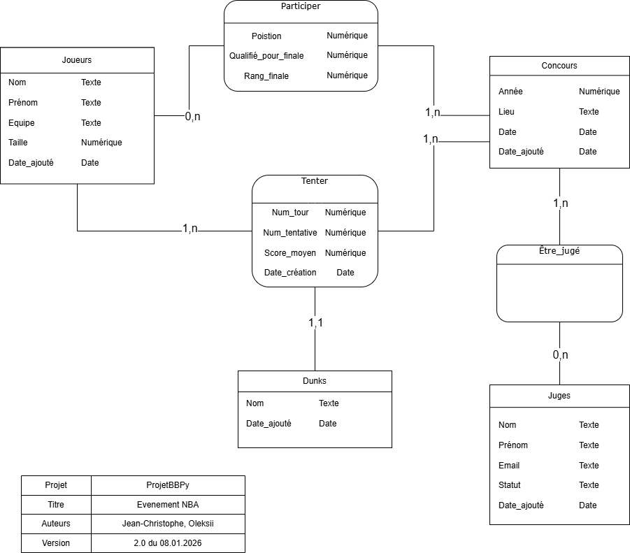

# Gestion d'un concours de Dunk NBA

## Description
Cette application Python permet de gérer un concours de dunks NBA à l’aide d’une interface graphique Tkinter et d’une base de données MySQL.

L’application couvre l’ensemble du déroulement d’un concours :
- gestion des joueurs et des juges
- création de concours
- déroulement des rounds
- notation des dunks
- calcul automatique des résultats et du classement final

## Fichiers python
python_main.py # Point d’entrée de l’application

python_display.py # Interface graphique (pages Tkinter)

python_database.py # Accès et gestion de la base de données

## Description des fichiers
### python_main.py
- Initialise la fenêtre principale Tkinter
- Gère la navigation entre les différentes pages
- Charge les images de fond
- Initialise la connexion à la base MySQL
- Lance l’application

### python_display.py
Contient l’interface graphique de l’application, organisée en plusieurs pages :

- **Page 1** : menu principal  
- **Page 2** : ajout d’un joueur  
- **Page 3** : suppression d’un joueur  
- **Page 4** : création d’un concours  
- **Page 5** : sélection et lancement d’un concours  
- **Page 6** : round 1 (demi-finales)  
- **Page 7** : finale et affichage du classement  

Chaque page hérite de `tk.Frame`.

### python_database.py
Gère toutes les interactions avec la base de données MySQL :
- joueurs, juges et types de dunks
- concours et participants
- essais, notes et moyennes
- qualification pour la finale
- classement final

## SGBD utilisé
- MySQL

## Tables principales
- players
- judges
- dunks
- contests
- contest_players
- contest_judges
- attempts
- scores

## Modèle Conceptuel de Données (MCD)



Ce MCD représente les entités principales du concours de dunks ainsi que leurs relations.

## Prérequis

- Python 3.x
- MySQL
- Modules Python requis :
```bash
pip install mysql-connector-python pillow 
```

## Configuration MySQL
DB_config = {
    "host": "127.0.0.1",
    "user": "root",
    "password": os.getenv("DB_password"),
    "database": "dunk_contest",
    "port": 3306
}

Le mot de passe MySQL doit être défini comme variable d’environnement :

export DB_password="votre_mot_de_passe"

## Auteurs
- Jean-Christophe Serrano
- Oleksii Kamarali

## Date
09.01.2026
